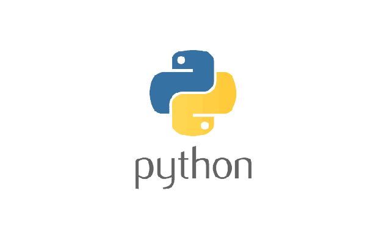
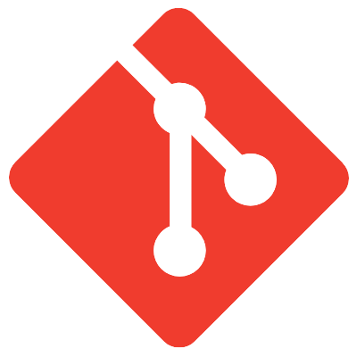
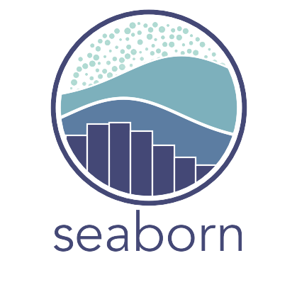
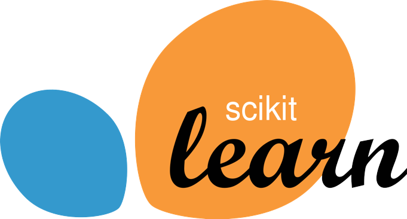

# Hello :wave: Welcome to my GitHub profile!

### My name is Jesus Alberto :metal:

## Who am I?

I am a reckless life-long learner with a college degree... 

(Yes, I know. It's hard to believe but I have one :sunglasses:)

:warning: I'm a Bachelor in Occupational Health and Safety :warning:

But I'm in love with technology :computer:, so I'm self-taught into Python and its environment :snake:

## Skills

These guys are my everyday buddies:

   

  

  

Plus, in my spare time I like to do Data Science :microscope: and open-source :open_file_folder: 

## Here you can see my favorite languages

### :arrow_down: DON'T FORGET TO CHECK OUT MY REPOS

### DOWN-BELOW-UNDER -U :arrow_heading_down:

### Then STAR :star2:

### Then FORK :trident:

### Then FOLLOW ME :octocat:

### Peace out :v:
<!---
jesusalberto18/jesusalberto18 is a ✨ special ✨ repository because its `README.md` (this file) appears on your GitHub profile.
You can click the Preview link to take a look at your changes.
--->
